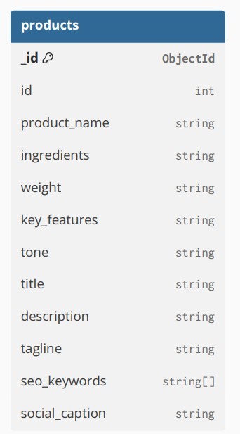

# ProDescription AI

An AI-powered web application designed to help food processing businesses create professional, SEO-friendly, and engaging product content for e-commerce platforms. The platform enables users to generate product descriptions, titles, taglines, keywords, and promotional content using AI.

---

## Project Overview

Many small and medium food processing businesses struggle to create compelling product listings for online marketplaces due to limited marketing resources and content-writing expertise.

ProDescription AI simplifies this process by allowing users to enter product information such as product name, ingredients, weight, and key features. The application then generates high-quality content tailored for e-commerce platforms.

---

## Features

### Content Generation

* AI-powered Product Description Generation
* Product Title Generation
* Product Tagline Generation
* Social Media Caption Generation

### Content Optimization

* SEO Keyword Recommendations
* Tone-Based Content Customization
* AI-Assisted Content Regeneration

### User Experience

* Clean and Responsive User Interface
* Multi-Page Navigation
* Dashboard Overview
* Mobile-Friendly Design

### Authentication & Security

* User Registration
* Secure Login using JWT Authentication
* Google OAuth Login (Firebase Authentication)
* Password Hashing using bcrypt
* Password Strength Validation
* Protected Routes
* User-Specific Product Management
* Rate Limiting for Authentication APIs

---

## Tech Stack

### Frontend

* React.js
* React Router DOM
* Tailwind CSS
* Vite
* Firebase Authentication
* Axios

### Backend

* FastAPI
* JWT Authentication
* bcrypt
* SlowAPI (Rate Limiting)
* Firebase Admin SDK

### Database

* MongoDB Atlas
* PyMongo

### AI Integration

* Rule-Based Content Generator (Current)
* Google Gemini API (Planned)

### Deployment

* Vercel (Planned)
* Render (Planned)

---

## Database Choice

This project uses **MongoDB Atlas** as the cloud database.

MongoDB was selected because product information is document-based and has a flexible schema. It integrates well with FastAPI using PyMongo and allows easy storage and retrieval of product data while supporting future scalability.

---

## Project Structure

```text
## Project Structure

│
├── frontend
│   ├── src
│   │   ├── assets
│   │   │   └── Images and static resources
│   │   │
│   │   ├── components
│   │   │   ├── Navbar.jsx
│   │   │   ├── Hero.jsx
│   │   │   ├── Footer.jsx
│   │   │   ├── FeatureCard.jsx
│   │   │   ├── WhyChooseUs.jsx
│   │   │   │
│   │   │   └── ui
│   │   │       ├── Button.jsx
│   │   │       ├── Input.jsx
│   │   │       ├── Modal.jsx
│   │   │       ├── Toast.jsx
│   │   │       ├── Loader.jsx
│   │   │       └── index.js
│   │   │
│   │   ├── pages
│   │   │   ├── Home.jsx
│   │   │   ├── About.jsx
│   │   │   ├── Dashboard.jsx
│   │   │   └── Generate.jsx
│   │   │
│   │   ├── App.jsx
│   │   ├── main.jsx
│   │   └── index.css
│   │
│   ├── package.json
│   └── vite.config.js
│
├── backend
├── images
│
├── .gitignore
└── README.md
```

---
## Backend

The backend is built using FastAPI and provides RESTful APIs for product content generation and management.

### Available APIs

- GET /
- GET /products
- GET /products/{id}
- POST /generate
- PUT /products/{id}
- DELETE /products/{id}
- GET /search
- POST /auth/register
- POST /auth/login
- POST /auth/google

---

### Database Integration

The backend is fully integrated with MongoDB Atlas using PyMongo.

All CRUD operations including product generation, retrieval, update, deletion, and search are now performed directly on the MongoDB database.

Environment variables are managed using a `.env` file.

---

## Database Schema

The application currently stores generated product information in a MongoDB collection named `products`.



---

## Set Up the Database

1. Create a free MongoDB Atlas cluster.
2. Create a database user.
3. Whitelist your IP address.
4. Copy the MongoDB connection string.
5. Create a `.env` file inside the backend folder.
6. Add your MongoDB connection string.
7. Install the required packages.
8. Start the backend server.

Example `.env`

```env
MONGO_URI=your_mongodb_connection_string
```

Install dependencies

```bash
pip install -r requirements.txt
```

Run backend

```bash
uvicorn app.main:app --reload
```

---


## Current Status

### Completed

- GitHub Repository Initialized
- React + Vite Frontend
- Tailwind CSS Configuration
- Responsive UI
- Multi-Page Routing
- Dashboard Page
- Generate Page
- Component Library
- FastAPI Backend
- RESTful CRUD APIs
- Search API
- Swagger API Documentation
- Frontend–Backend Integration using Axios
- Dark / Light Mode
- Error Handling & Loading States
- MongoDB Atlas Integration
- Database CRUD Operations
- Environment Variable Configuration
- Persistent Data Storage
- User Registration & Login
- JWT Authentication
- Google OAuth Authentication
- Password Hashing (bcrypt)
- Password Validation
- Protected Routes
- User-Specific Products
- Rate Limiting (SlowAPI)

### Upcoming

- Google Gemini API Integration
- PDF Export
- Deployment (Vercel + Render)

---

## Author

Rahul Devrani

Technology Business Incubator (TBI-GEU)

Summer Internship Program 2026
