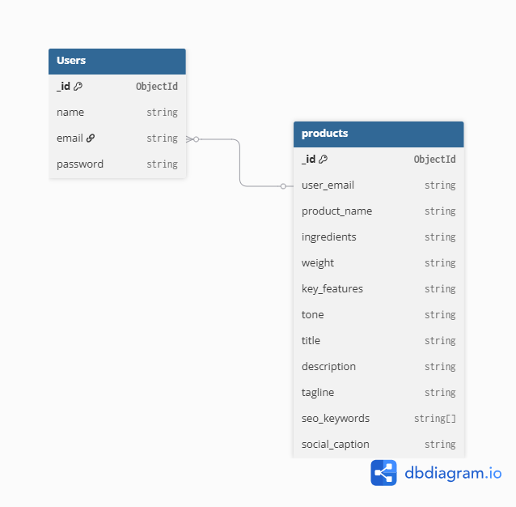

# ProDescription AI

An AI-powered web application designed to help food processing businesses create professional, SEO-friendly, and engaging product content for e-commerce platforms. The platform enables users to generate product descriptions, titles, taglines, keywords, and promotional content using AI.

---

## Project Overview

Many small and medium food processing businesses struggle to create compelling product listings for online marketplaces due to limited marketing resources and content-writing expertise.

ProDescription AI simplifies this process by allowing users to enter product information such as product name, ingredients, weight, and key features. The application then generates high-quality content tailored for e-commerce platforms.

The application integrates Google's Gemini AI to generate structured marketing content in JSON format, which is parsed and displayed by the React frontend.
---

## Features

### AI Content Generation

* AI Product Title
* AI Product Description
* AI Product Tagline
* AI SEO Keywords
* AI Social Media Caption
* AI Regeneration

### Content Optimization

* SEO Keyword Recommendations
* Tone-Based Content Customization
* AI-Assisted Content Regeneration

### User Experience

* Clean and Responsive User Interface
* Multi-Page Navigation
* Dashboard Overview
* Mobile-Friendly Design

### Authentication & Security

* User Registration
* Secure Login using JWT Authentication
* Google OAuth Login (Firebase Authentication)
* Password Hashing using bcrypt
* Password Strength Validation
* Protected Routes
* User-Specific Product Management
* Rate Limiting for Authentication APIs

---

## Tech Stack

### Frontend

* React.js
* React Router DOM
* Tailwind CSS
* Vite
* Firebase Authentication
* Axios

### Backend

* FastAPI
* JWT Authentication
* bcrypt
* SlowAPI (Rate Limiting)
* Firebase Admin SDK
* Google Gemini API
* google-genai SDK

### Database

* MongoDB Atlas
* PyMongo

### AI Integration

* Google Gemini API
* Gemini Flash Model
* AI-powered Product Title Generation
* AI-powered Product Description Generation
* AI-powered Product Tagline Generation
* AI-powered SEO Keyword Generation
* AI-powered Social Media Caption Generation

### Live Application

- **Frontend:** https://prodescription.netlify.app
- **Backend API:** https://ai-product-description-generator-vlqe.onrender.com
- **Swagger Documentation:** https://ai-product-description-generator-vlqe.onrender.com/docs

The frontend is deployed on Netlify, while the FastAPI backend is deployed on Render. MongoDB Atlas is used as the cloud database and Firebase Authentication is used for secure user authentication.

## Known Limitations

* The backend is hosted on Render's free tier. If the application remains inactive for some time, the first request may take 30–60 seconds while the backend wakes up.
* AI content generation depends on the availability and quota of the Google Gemini API.
* Internet connectivity is required for AI content generation and authentication services.

---

## Database Choice

This project uses **MongoDB Atlas** as the cloud database.

MongoDB was selected because product information is document-based and has a flexible schema. It integrates well with FastAPI using PyMongo and allows easy storage and retrieval of product data while supporting future scalability.

---

```text
## Project Structure

│
├── frontend
│   ├── src
│   │   ├── assets
│   │   │   └── Images and static resources
│   │   │
│   │   ├── components
│   │   │   ├── Navbar.jsx
│   │   │   ├── Hero.jsx
│   │   │   ├── Footer.jsx
│   │   │   ├── FeatureCard.jsx
│   │   │   ├── WhyChooseUs.jsx
│   │   │   │
│   │   │   └── ui
│   │   │       ├── Button.jsx
│   │   │       ├── Input.jsx
│   │   │       ├── Modal.jsx
│   │   │       ├── Toast.jsx
│   │   │       ├── Loader.jsx
│   │   │       └── index.js
│   │   │
│   │   ├── pages
│   │   │   ├── Home.jsx
│   │   │   ├── About.jsx
│   │   │   ├── Dashboard.jsx
│   │   │   └── Generate.jsx
│   │   │
│   │   ├── App.jsx
│   │   ├── main.jsx
│   │   └── index.css
│   │
│   ├── package.json
│   └── vite.config.js
│
├── backend
├── images
│
├── .gitignore
└── README.md
```

---
## Backend

The backend is built using FastAPI and provides RESTful APIs for product content generation and management.

### Available APIs

- GET /
- GET /products
- GET /products/{id}
- POST /generate
- PUT /products/{id}
- DELETE /products/{id}
- GET /search
- POST /auth/register
- POST /auth/login
- POST /auth/google

---

### Database Integration

The backend is fully integrated with MongoDB Atlas using PyMongo.

All CRUD operations including product generation, retrieval, update, deletion, and search are now performed directly on the MongoDB database.

Environment variables are managed using a `.env` file.

---

## Database Schema

The application uses **MongoDB Atlas** as the cloud database and consists of two collections:

### users
Stores registered user information such as:
- Name
- Email Address
- Encrypted Password

### products
Stores AI-generated product information such as:
- Product Name
- Ingredients
- Weight
- Key Features
- Tone
- Generated Title
- Description
- Tagline
- SEO Keywords
- Social Media Caption

Each product is associated with the authenticated user, ensuring that users can access and manage only their own generated content.



---

## Set Up the Database

Follow these steps to configure the project with MongoDB Atlas:

1. Create a free MongoDB Atlas cluster.
2. Create a database user with read and write access.
3. Add your IP address (or allow access from all IPs for development).
4. Copy the MongoDB connection string.
5. Create a `.env` file inside the `backend` directory.
6. Add the required environment variables, including the MongoDB connection string, JWT configuration, and Gemini API key.
7. Install all required dependencies.
8. Start the FastAPI backend server.

### Example `.env`

```env
MONGO_URI=your_mongodb_connection_string
JWT_SECRET=your_secret_key
JWT_ALGORITHM=HS256
TOKEN_EXPIRE_DAYS=7
GEMINI_API_KEY=your_gemini_api_key
```
> **Note:**  
> To enable Google Authentication, place your Firebase Admin SDK service account key (`firebase-key.json`) inside the `backend/app/firebase/` directory or configure it securely using environment variables or secret files when deploying the application.

### Install Dependencies

```bash
pip install -r requirements.txt
```

### Run Backend

```bash
uvicorn app.main:app --reload
```
---

## Current Status

### Completed

- GitHub Repository Initialized
- React + Vite Frontend
- Tailwind CSS Configuration
- Responsive UI
- Multi-Page Routing
- Dashboard Page
- Generate Page
- Component Library
- FastAPI Backend
- RESTful CRUD APIs
- Search API
- Swagger API Documentation
- Frontend–Backend Integration using Axios
- Dark / Light Mode
- Error Handling & Loading States
- MongoDB Atlas Integration
- Database CRUD Operations
- Environment Variable Configuration
- Persistent Data Storage
- User Registration & Login
- JWT Authentication
- Google OAuth Authentication
- Password Hashing (bcrypt)
- Password Validation
- Protected Routes
- User-Specific Products
- Rate Limiting (SlowAPI)
- Google Gemini API Integration
- Prompt Engineering Documentation

### Future Enhancements

- PDF Export
- Download as DOCX
- Product History
- Multi-language Support
- AI Tone Presets

---

## Author

**Rahul Devrani**

B.Tech CSE (AI & Data Science)

Graphic Era Deemed to be University

Technology Business Incubator (TBI-GEU)

Summer Internship Program 2026
